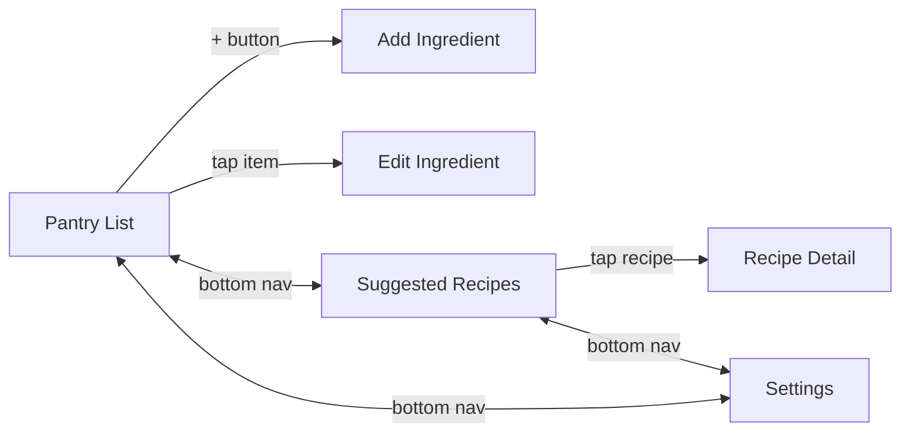
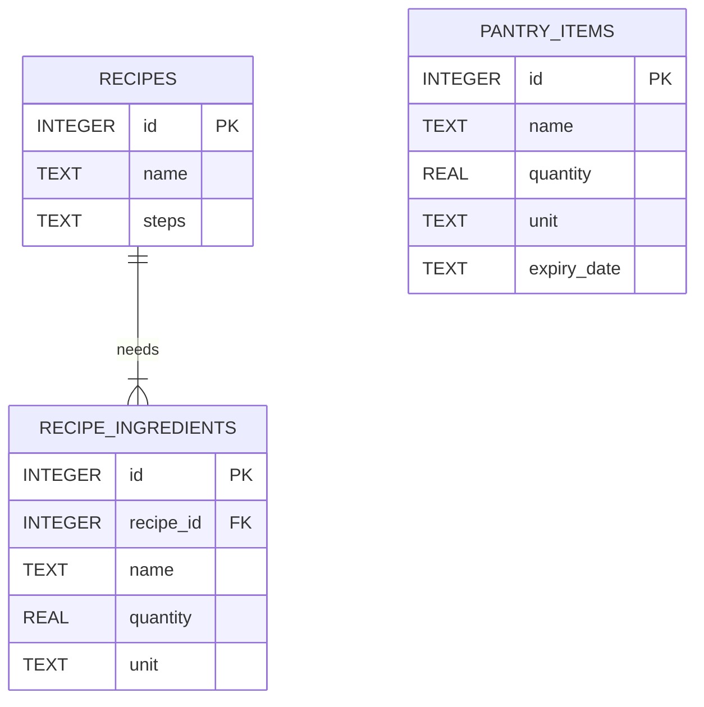

# Smart Pantry Manager

A Java Android app that helps reduce food waste. The user keeps track of the ingredients they have at home (their **pantry**), and the app suggests recipes they can cook **using only those ingredients**.

A recipe is only suggested if **every** ingredient it needs is in the pantry **in at least the required quantity**. If even one ingredient is missing, the recipe is not suggested.

## Features

- **Pantry management (full CRUD):** add, view, edit and delete ingredients (name, quantity, unit and optional expiry date)
- **Suggested Recipes:** strict matching against 20 recipes that are seeded into the database on first run
- **Smart matching:** handles upper/lower case, plurals ("tomatoes" = "tomato"), common alternative names ("scallion" = "spring onion") and unit conversion (kg to g, l to ml, cups/tbsp/tsp to ml)
- **Recipe detail:** full ingredient list with a tick or cross for each item, plus the method
- **"I cooked this" button:** subtracts the used ingredients from the pantry
- **Expiry alerts:** items that are expired or about to expire are highlighted
- **Almost There (bonus):** a separate list of recipes missing exactly one ingredient
- **Settings:** expiry alerts on/off, number of warning days, Almost There on/off, default unit
- Input validation on the add/edit form
- Friendly message when no recipes match
- No maps, no GPS, no internet permission: the app works fully offline

## Screens

| Screen | Activity |
|---|---|
| Pantry List (launcher) | `MainActivity` |
| Add / Edit Ingredient | `AddEditIngredientActivity` |
| Suggested Recipes | `SuggestedRecipesActivity` |
| Recipe Detail | `RecipeDetailActivity` |
| Settings | `SettingsActivity` |

Navigation uses a bottom navigation bar (Pantry, Recipes, Settings) and explicit Intents. Item and recipe ids are passed between screens as Intent extras.



## Database choice: SQLite (SQLiteOpenHelper)

I chose **SQLite** because:

1. It is built into Android, so no extra setup, accounts or internet connection are needed.
2. A pantry is personal data on one device, so cloud sync is not needed.
3. It works offline, which suits a kitchen app.
4. It is the approach covered in the module's persistent data chapter.



Settings are stored separately with `SharedPreferences`.

## Project structure

```
app/src/main/java/com/example/smartpantry/
├── MainActivity.java                 Pantry list
├── AddEditIngredientActivity.java    Add / edit form with validation
├── SuggestedRecipesActivity.java     Strict suggestions + Almost There
├── RecipeDetailActivity.java         Ingredients, method, "I cooked this"
├── SettingsActivity.java             User settings
├── NavHelper.java                    Bottom navigation
├── adapter/   PantryAdapter, RecipeAdapter   (custom RecyclerView adapters)
├── database/  DatabaseHelper                 (SQLite CRUD + seed recipes)
├── logic/     RecipeMatcher, IngredientUtils (strict-matching rule)
├── model/     PantryItem, Recipe, RecipeIngredient
└── util/      AppSettings, DateUtils
```

## Setup and run

1. Install **Android Studio** (Koala or newer) with JDK 17 (bundled with Android Studio).
2. Clone the repository:
   ```
   git clone https://github.com/<your-username>/SmartPantryManager.git
   ```
3. In Android Studio choose **File > Open** and select the `SmartPantryManager` folder.
4. Wait for Gradle sync to finish.
5. Start an emulator (API 24 or higher) or connect a phone with USB debugging on.
6. Press **Run** (green play button).

To run the unit tests for the matching logic: right-click `app/src/test/.../RecipeMatcherTest.java` and choose **Run**.

## Quick demo of the strict rule

1. Add: Eggs 6 pcs, Milk 1 l, Butter 250 g.
2. Open **Recipes**: *Scrambled Eggs* appears.
3. Edit Eggs to 2 pcs (recipe needs 3): *Scrambled Eggs* disappears.
